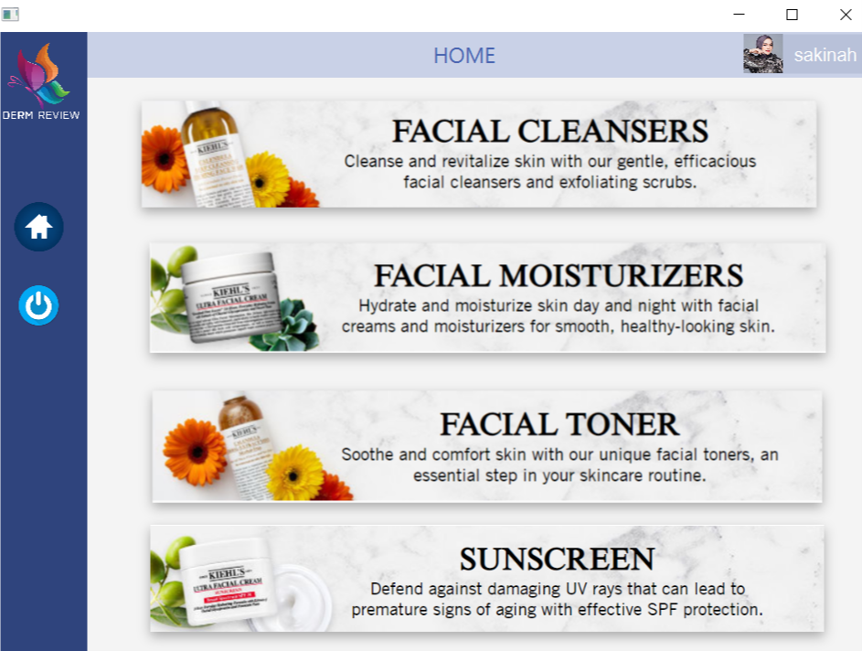
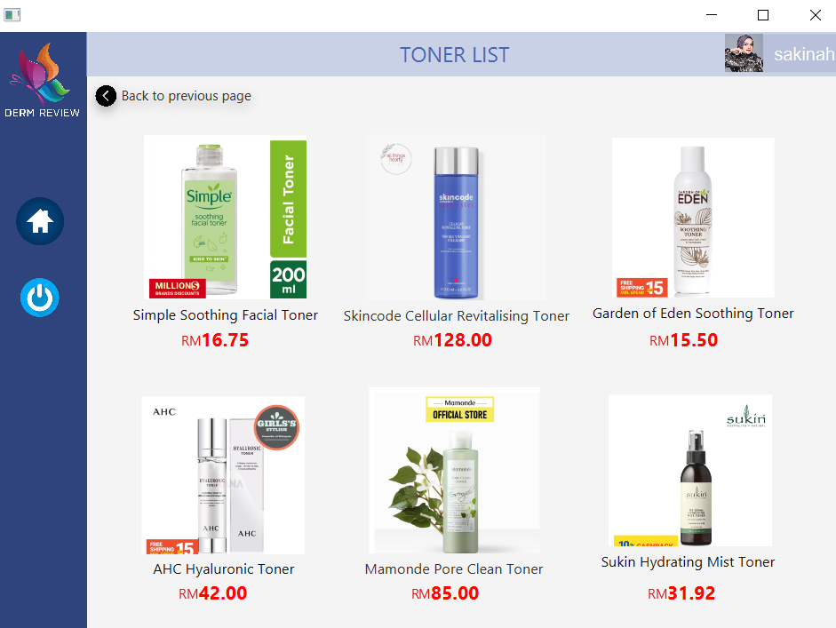
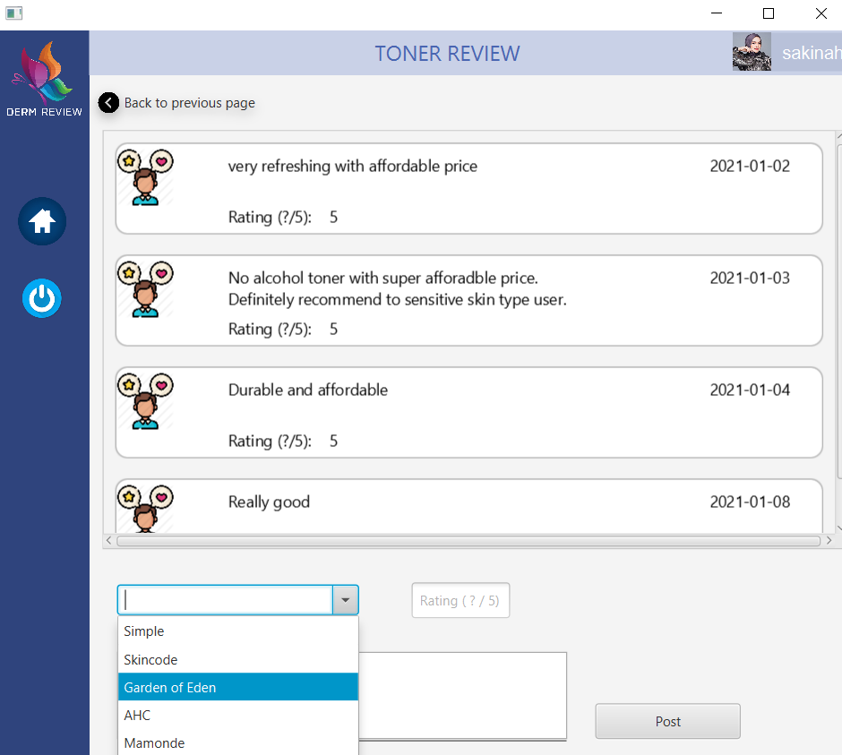
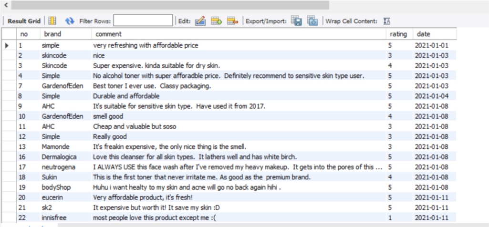

# CAT201-Project-2020
CAT 201 Group Project (Teoh Sin Yee, Aqilah Syahirah Binti Shahabudin, Siti Sakinah Binti Ahmad Sanusi)

DermReview is a desktop application allowed users to read and submit reviews towards different types of skin care products.
There are multiple brands for each type of skin care product.
Thus, we have used database to store the reviews of every users.

# Tools used
1. MySQL
2. SceneBuilder

# Login Page

# Sign Up Page

# Main Page

# Product List Page

# User review Page

# Database interface (MySQL) 

